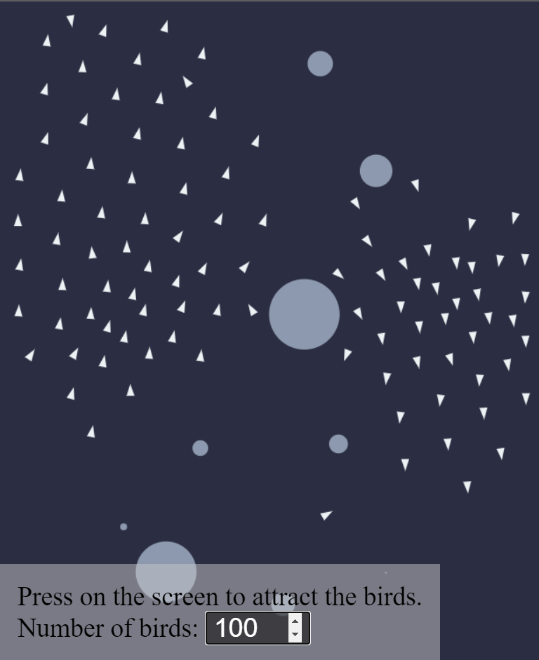

# Boids Flocking Simulation

This repository contains a TypeScript implementation of the [Boids](http://www.red3d.com/cwr/boids/) flocking algorithm, developed by Craig Reynolds in 1986. The simulation models the complex behaviors of bird flocks, fish schools, or any group of creatures exhibiting swarm intelligence.

## Features

-   Flocking Behavior: Each boid in the simulation follows three simple rules - separation, alignment, and cohesion. Together, these rules result in realistic flocking behavior.
-   Obstacle Avoidance: Boids will steer clear of obstacles in their path.
-   Edge Avoidance: Boids will be repelled by the edges of the screen to keep them within view.
-   Cursor Interaction: Boids are attracted to the cursor, allowing you to interact with the flock.

